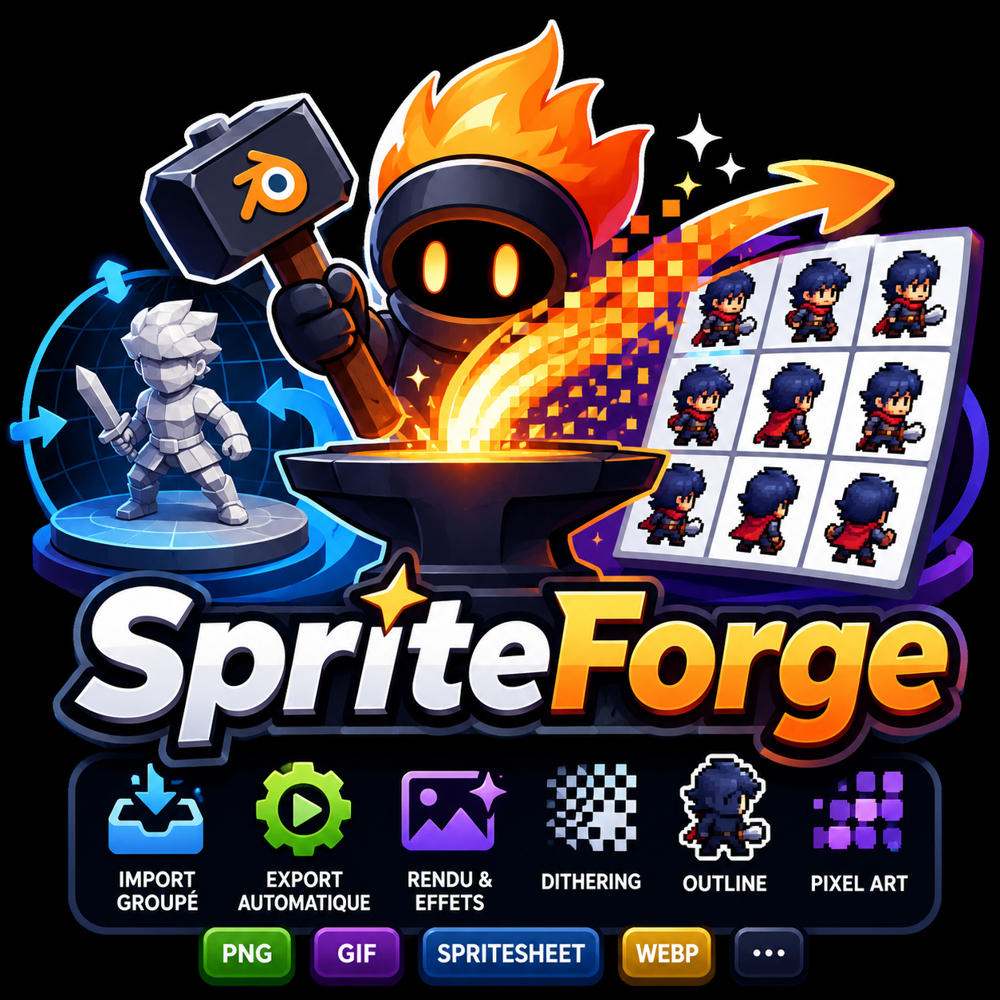

# 🔥 SpriteForge

<p align="center">
  
</p>

<p align="center">
  <strong>Transformez vos modèles 3D en sprites 2D isométriques professionnels directement depuis Blender.</strong>
</p>

<p align="center">
  Créé par <strong>Cortex</strong><br>
  Game dev • Artiste 2D • Animateur • Pixel Artist
</p>

---

## 📖 Présentation

SpriteForge est un addon Blender conçu pour automatiser la création de sprites 2D à partir de modèles 3D.

Il permet de générer rapidement :

* Sprites PNG individuels
* Spritesheets complètes
* GIF animés
* Normal Maps
* Sprites Pixel Art
* Assets isométriques multi-directions

L'objectif est de supprimer les tâches répétitives liées au rendu de personnages et d'assets destinés aux jeux 2D.

---

## ✨ Fonctionnalités

### 🧍 Personnages animés

* Import automatique des personnages FBX
* Détection des animations
* Synchronisation automatique des plages de frames
* Export d'une animation spécifique
* Export de toutes les animations
* Gestion du Root Motion

### 🏠 Assets statiques

Formats supportés :

* FBX
* OBJ
* GLB
* GLTF
* DAE

Fonctionnalités :

* Import automatique
* Rotation multi-directions
* Cadrage automatique
* Export optimisé pour les jeux 2D

### 🎨 Pixel Art intégré

* Prévisualisation temps réel
* Grille Pixel Art
* Résolutions de 16 à 256 pixels
* Outline automatique
* Dithering Floyd-Steinberg
* Anti-aliasing optionnel
* Réduction de palette

### 📦 Formats d'export

* PNG
* Spritesheet
* GIF par direction
* GIF unique
* Normal Maps

### 💡 Optimisations visuelles

* Couleurs mates anti-métalliques
* Gestion des ombres
* Éclairage optimisé
* Auto-crop intelligent
* Caméra orthographique isométrique

---

# ⚙️ Compatibilité

SpriteForge a été :

* développé
* testé
* optimisé

sur :

## Blender 5.1.1

> ⚠️ L'utilisation sur une autre version de Blender n'est pas officiellement garantie.

---

# 🚀 Installation

## 1. Installer l'addon

Dans Blender :

```text
Edit
└── Preferences
    └── Add-ons
```

Cliquez sur :

```text
Install from Disk...
```

Sélectionnez le fichier ZIP de SpriteForge puis activez :

```text
Cortex SpriteForge
```

---

## 2. Ouvrir SpriteForge

Une fois l'addon installé :

1. Ouvrez Blender
2. Passez dans l'onglet :

```text
Layout
```

3. Placez votre souris dans la vue 3D
4. Appuyez sur :

```text
N
```

pour ouvrir la Sidebar Blender.

5. Sélectionnez l'onglet :

```text
SpriteForge
```

Le panneau principal de l'addon apparaît alors.

---

# 🎮 Workflow Personnages

## Étape 1

Choisissez :

```text
Characters
```

---

## Étape 2

Sélectionnez votre dossier contenant :

* FBX
* Textures
* Animations

SpriteForge analyse automatiquement le contenu.

---

## Étape 3

Cliquez sur :

```text
Import Characters
```

---

## Étape 4

Vérifiez le cadrage dans la vue caméra.

SpriteForge crée automatiquement :

* la caméra orthographique
* le rig caméra
* l'éclairage principal

---

## Étape 5

Choisissez la taille de sprite :

```text
32
48
64
96
128
192
256
384
512
1024
```

---

## Étape 6

Choisissez le format d'export :

### PNG

Une image par frame.

### Spritesheet

Toutes les frames regroupées.

### GIF_DIR

Un GIF par direction.

### GIF_ONE

Toutes les directions dans un GIF unique.

---

## Étape 7

Cliquez sur :

```text
Render
```

SpriteForge génère automatiquement les fichiers exportés.

---

# 🏠 Workflow Assets

Passez en mode :

```text
Assets
```

Puis :

1. Sélectionnez votre dossier d'assets
2. Importez les modèles
3. Choisissez le nombre de directions
4. Réglez le cadrage
5. Lancez l'export

---

# 🎨 Utilisation du mode Pixel Art

Activez :

```text
Pixel Art
```

Options disponibles :

| Fonction      | Description                 |
| ------------- | --------------------------- |
| Grille        | Prévisualisation des pixels |
| Outline       | Contour automatique         |
| Dithering     | Effet rétro                 |
| Anti-Aliasing | Lissage des bords           |
| Résolution    | 16 à 256 px                 |

### Configuration recommandée

#### Pixel Art rétro

```text
Pixel Art       ON
Outline         ON
Anti-Aliasing   OFF
Dithering       ON
```

#### Pixel Art moderne

```text
Pixel Art       ON
Outline         OFF
Anti-Aliasing   ON
Dithering       OFF
```

---

# 📷 Caméra SpriteForge

SpriteForge utilise une caméra orthographique spécialement configurée pour les rendus isométriques.

Paramètres disponibles :

* Largeur
* Hauteur
* Offset X
* Offset Y
* Offset Z

Le recadrage est ensuite effectué automatiquement lors du rendu.

---

# ⚠️ Erreurs fréquentes

## Le panneau SpriteForge n'apparaît pas

Vérifiez :

* que l'addon est activé
* que vous êtes dans l'espace de travail Layout
* que vous avez appuyé sur N
* que l'onglet SpriteForge est sélectionné

---

## Les sprites sont coupés

Augmentez :

* Largeur caméra
* Hauteur caméra

---

## Les animations ne sont pas détectées

Vérifiez :

* la présence d'une armature
* la présence d'Actions Blender
* l'export FBX d'origine

---

## Le rendu est flou

Pour un rendu Pixel Art :

```text
Anti-Aliasing OFF
```

---

# 💡 Conseils

### Assets générés avec Meshy

Activez :

```text
Couleurs mates
```

pour supprimer les reflets métalliques excessifs.

### Jeux HD-2D

Configuration recommandée :

```text
Pixel Art OFF
Couleurs mates ON
Ombres OFF
```

---

# ❤️ Auteur

## Cortex

Game dev • Artiste 2D • Animateur • Pixel Artist

Créateur de SpriteForge.

---

# 📜 Licence

Voir le fichier `LICENSE`.

---

<p align="center">
🔥 Merci d'utiliser SpriteForge 🔥
</p>
